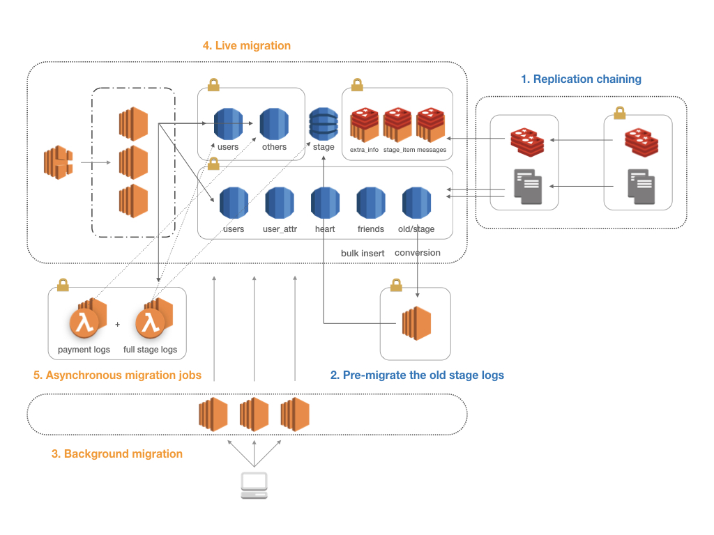

# Architecture By Me (@mingrammer)

A collection of system architectures I've designed ever (@mingrammer).

*Note: These may not best practices, just one of possible architectures for corresponding systems*

## Game server data migration (experimental)

## Ethereum blockchain based dAPP (remittance service)

## On demand image server for generating dynamic images

> Project Repository: [fitter](https://github.com/mingrammer/fitter)

## Python repository analysis service

> Project Repository: [pyreportcard](https://github.com/mingrammer/pyreportcard)

## Video streaming web service

