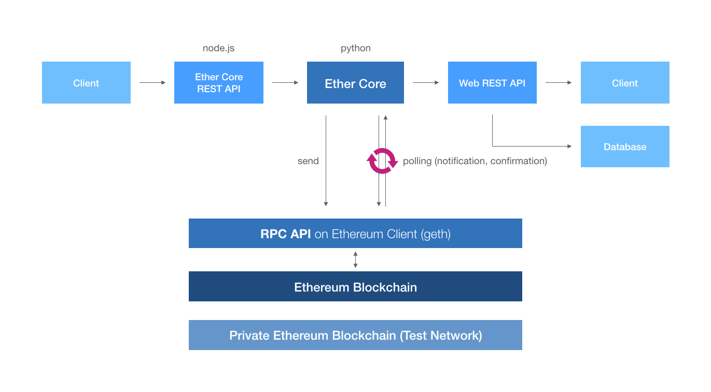
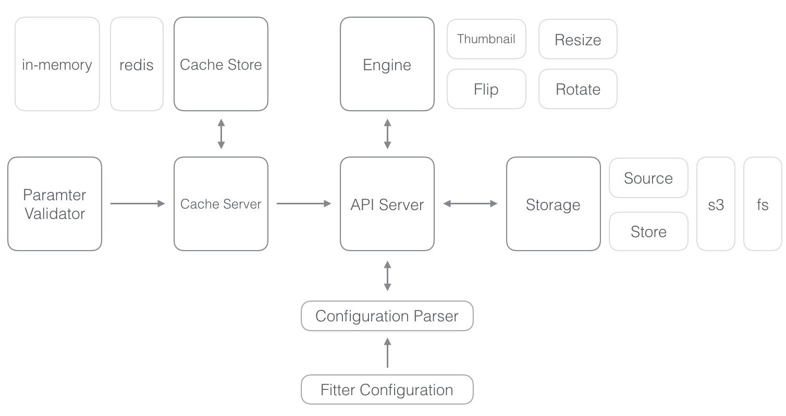
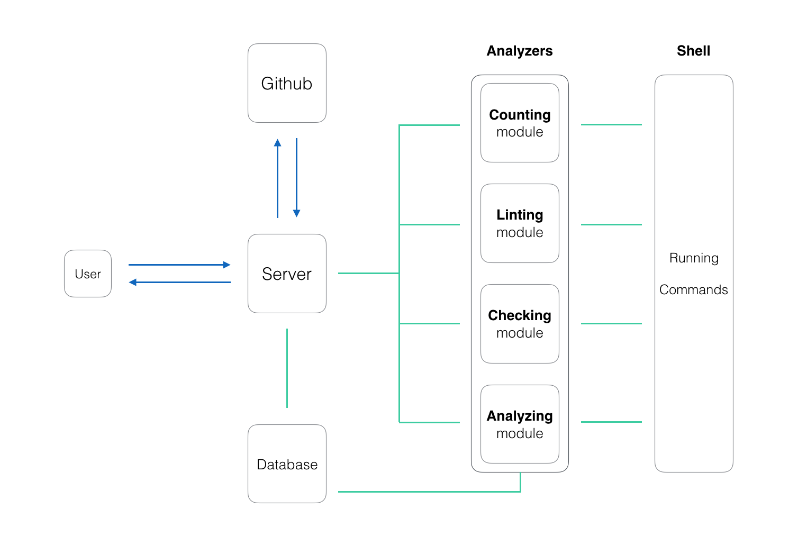
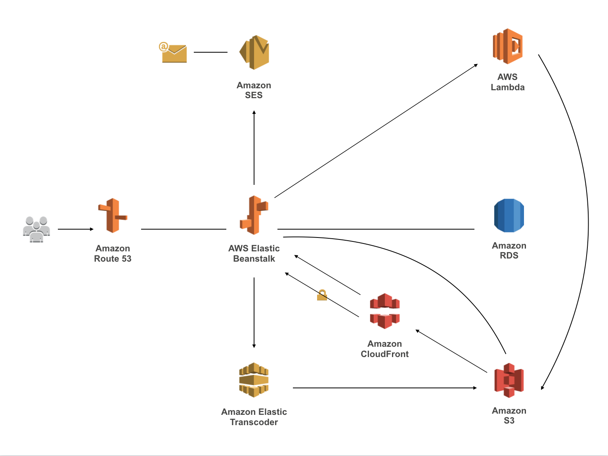

# Architecture By Me (@mingrammer)

A store of architectures made by me (@mingrammer). 

*Note: These are not best practices, just one of possible architectures for corresponding apps or systems*

 

## Ethereum blockchain based dAPP (remittance service)

 

## On demand image server for generating dynamic images

> Project Repository: [fitter](https://github.com/mingrammer/fitter)

 

## Python repository analysis service

> Project Repository: [pyreportcard](https://github.com/mingrammer/pyreportcard)

 

## Video streaming based web service

